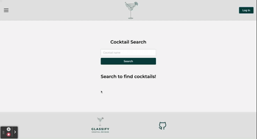
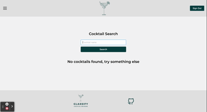

# Glassify

Glassify is a MERN full stack application developed in order to help users search for their favorite cocktails from a database. Users can then save their favorite cocktails to a saved cocktail list and also leave reviews on cocktails for other registered users of the website to see. 

## Usage and Deployed Link
As a non-registered user, users are able to search cocktails.

[Deployed Link](https://glassify.herokuapp.com/)

As a registered user, users are able to search cocktails, save cocktails to a list, and also review cocktails.

## Technologies Used

### Client

- 
- 
- 
- 
- 
- [Mantine](https://mantine.dev/pages/getting-started/)
- [React Rating Stars Component](https://www.npmjs.com/package/react-rating-stars-component)
- [React Scripts](https://www.npmjs.com/package/react-scripts)
- [Tabler Icons](https://www.npmjs.com/package/@tabler/icons)

### Server

- 
- 
- 
- [Bcrypt](https://www.npmjs.com/package/bcrypt)
- [dotenv](https://www.npmjs.com/package/dotenv)
- [JSON Web Token](https://www.npmjs.com/package/jsonwebtoken)
- [Mongoose](https://www.npmjs.com/package/mongoose)

### Other

- 
- [Concurrently](https://www.npmjs.com/package/concurrently)

## Credits 
- Carlos Martinez
    * [GitHub](https://github.com/carmart7)
- Kendrick Brown
    * [GitHub](https://github.com/KennyB39)
- Pengteda Cheng 
    * [GitHub](https://github.com/teedaa)
- Peter Kim
    * [GitHub](https://github.com/PeterKim89)
